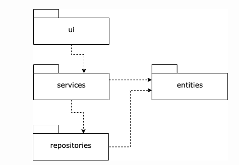
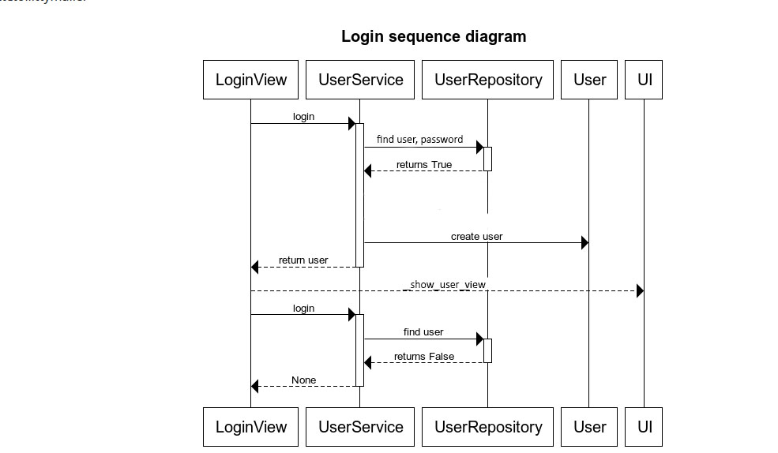

# Arkkitehtuurikuvaus

## Rakenne

Ohjelman rakenne on kolmitasoinen: ui-kansio sisältää sovelluksen käyttöliittymästä vastaavia luokkia, services-kansio sovelluslogiikan, ja repositories-kansio tietokantatoiminnot. Entities-kansio sisältää käyttäjäluokan, jota services- ja repositories-kansioiden luokat käyttävät.

##Päätoiminnallisuudet

Kuvataan seuraavaksi sovelluksen toimintalogiikka muutaman päätoiminnallisuuden osalta sekvenssikaaviona.

### Sisäänkirjautuminen

