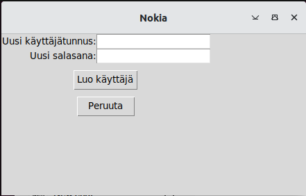
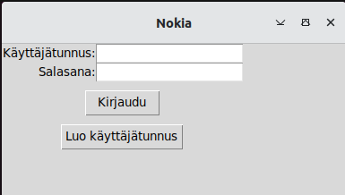
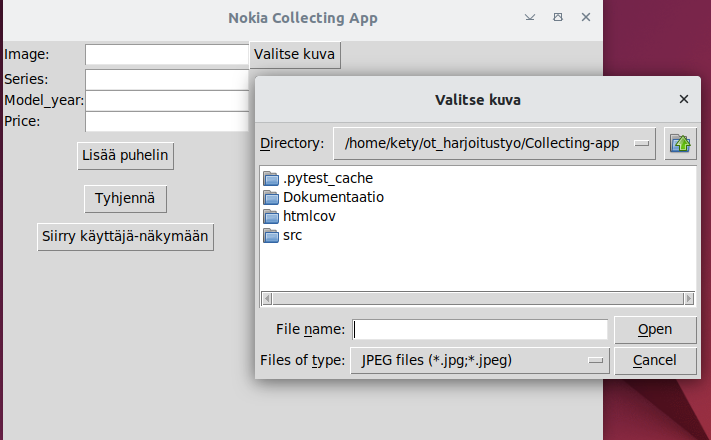
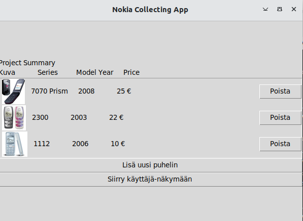

# Käyttöohje
Mikäli olet asentanut ohjelman README:n mukaisesti, käynnistä ohjelma.

## Ohjelman käynnistäminen

Käynnistä ohjelma komennolla:
    ```poetry run invoke start```


## Uudenkäyttäjän luominen

Valitse "Luo Käyttäjätunns". Anna haluamasi käyttäjätunnus. Valitse "Kirjaudu".




## Sisäänkirjautuminen

Mikäli oletkirautunut ulos, voit nyt valita suoran "Kirjautu" ja pääset käyttäjänäkymään.

 


## Käyttäjäjan sivu

Valitse käyttäjänäkymästä 'Kirjaudu ulos' tai 'Lisää projekti'. Projektin tilanne on vielä kehityksessä, ja nappi ei toimi kunnolla.


## Puhelimen lisääminen kokoelmaan

Voit lisätä puhelimen täyttämällä lomakkeen tyhjät kentät. "Lisää puhelin" -painikkeesta näet kaikki lisäämäsi puhelimet taulukossa.
Valitse "Lisää kuva" ja voit lisätä kuvan uudesta puhelimesta.



### Projektinäkymä

Tässä näkymässä käyttäjä näkee kaikki kokoelmassa olevat puhelimet. 




## Ohjelman sulkeminen

Sulje ohjelma X-painikkeesta tai kirjautu ulos.
