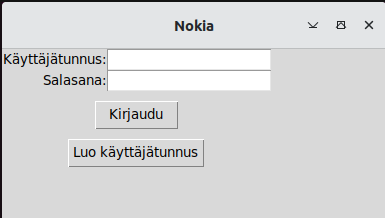
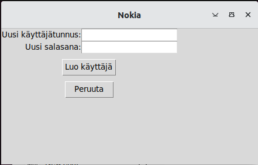
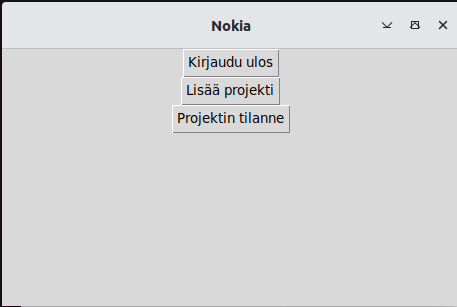
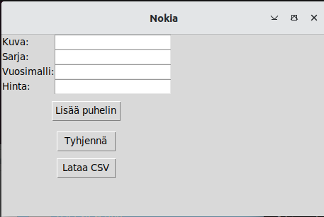
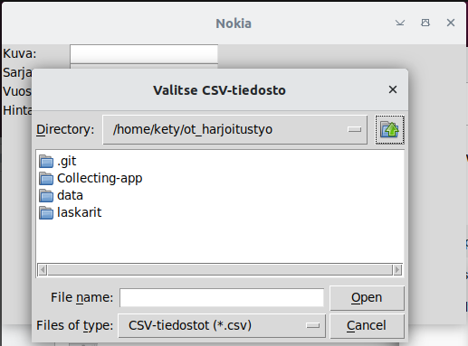

# Käyttöohje
Lataa tiedosto ja siirry terminalissa Collecting-app-kansioon


## Ohjelman käynnistäminen

1. Asenna riippuvuudet komennolla:

    ```poetry install
    ```
2. Käynnistä sovellus komennolla:

    ```bash
    poetry run invoke start
    ```


## Sisäänkirjautuminen

Käynnistä ohjelma. Voit valita suoran "Kirjautu" ja pääset käyttäjänäkymään.

 

## Uudenkäyttäjän luominen

Voit vierailla 'Luo käyttäjätunnus' -sivulla ja pääset takaisin napista "Peruuta". "Luo käyttäjätunnus" -toiminto ei ole toistaiseksi vielä käytössä.



## Käyttäjäjan sivu

Valitse käyttäjänäkymästä 'Kirjaudu ulos' tai 'Lisää projekti'. Projektin tilanne on vielä kehityksessä, ja nappi ei toimi kunnolla.



## Puhelimen lisääminen kokoelmaan

Käyttäliittymä toimii, mutta toiminnot ovat vielä kehityksessä.



### csv-tiedoston lisääminen ohjelmaan

Valitse "Lataa CSV" ja voit tuoda kokoelman CSV-tiedostosta ohjelmaan ja jatkaa harrastuksen ylläpitoa ohjelmassa. 
Käyttöliittymä toimii, mutta ladatun tiedoston siirto projektinäkymään on vielä kehityksessä, joten latamalla tiedoston Joten tiedoston lataamisella saadaan virheilmoitusksen "Tiedoston latauksessa tapahtui virhe".




## Ohjelman sulkeminen

Sulje ohjelma X-painikkeesta.
