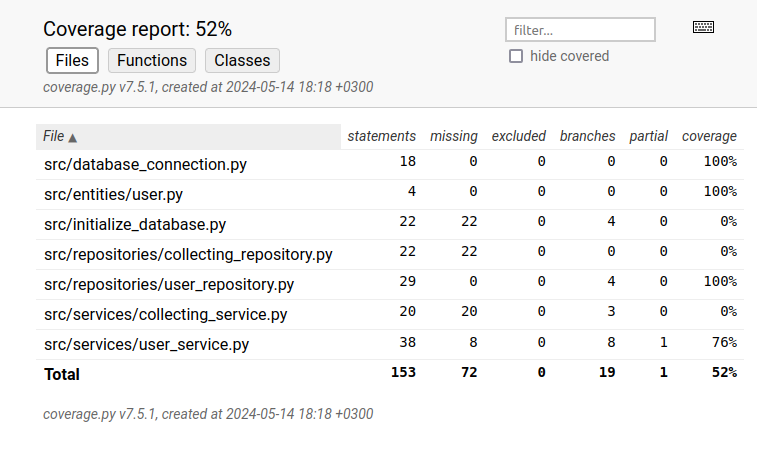

# Testausdokumentti

Ohjelmaa on testattu manuaalisesti järjestelmätasolla sekä automatisoiduin yksikkö- ja integraatiotestein unittestilla.

## Yksikkö- ja integraatiotestaus

### Sovelluslogiikka

Sovelluslogiikasta vastaavaat luokat CollectingServic ja UserService ja Sovelluksen käyttöliittymästä vastaavat luokat UserRepository ja CollectingRepository.  

UserService-luokat testataan [TestUserService](https://github.com/KetuKuu/ot_harjoitustyo/tree/master/Collecting-app/src/tests/services). Sille alustetaan tietokantayhteys testitietokantaan, User-luokka sekä UserRepository-luokka.

### Repositorio-luokat 
UserRepository-luokka on testattu [TestUserService](https://github.com/KetuKuu/ot_harjoitustyo/blob/master/Collecting-app/src/tests/repositories/user_repository_test.py) -testiluokalla. Sitä varten on luodu tietokantayhteys testitietokantaan.

### Testauskattavuus
Käyttöliittymäkerrosta lukuunottamatta sovelluksen testauksen haarautumakattavuus on 52 %

Testaamatta jäivät vielä CollectingServic-luokka ja CollectingRepository-luokka.

## Järjestelmätestaus
Sovelluksen järjestelmätestaus on suoritettu manuaalisesti.

Sovellus on haettu ja sitä on testattu [README](./README.md)  kuvaamalla tavalla vain Linux-ympäristössä. Kaikki [vaatimusmäärittelyn](./vaatimusmaarittely.md) ☑  ilmoittamat toiminnot on testattu ja toimivat. 
