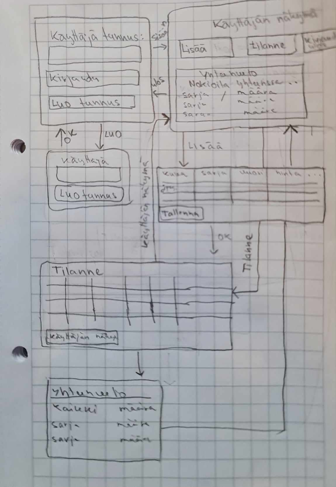

# **Vaatimusmäärittely**

**Sovelluksen tarkoitus**
Sovellus on tarkoitettu keräilyharrastuskäyttöön yksityishenkilöille.
Sovelluksella seurataan keräilijän kokoelmassa olevia Nokia-puhelimia.
Sovellukseen pystyy kirjautumaan ja sen avulla voi lisätä, muokata, seurata ja poistaa kokoelmassa olevia puhelimia.

**Käyttäjät**
Alkuvaiheessa sovelluksella on ainoastaan yksi käyttäjärooli.

**Käyttöliittymäluonnos**
Käyttäjänäkymässä avautuvat vaihtoehdot ovat kirjaudu ulos, lisää projekti, projektitilanne, tiimi (jatkokehitys) ja yhteenveto. 
Käyttäjäsivulla oleva yhteenveto on numeromuodossa ja heijastaa automaattisesti projektin tilanteen yhteenvetona. 
Projektin lisäämisnäkymässä lisätään projektin tiedot valmiiseen taulukkonäkymään. 
Kaikki sarakkeet ovat muokattavissa ja käyttäjä voi lisätä ja poistaa rivejä. 
Projektin tilannenäkymässä pääsee takaisin käyttäjänäkymään.

**Perusversion tarjoama toiminnallisuus**

* Ennen kirjautumista
	* Käyttäjä luo käyttäjätunnuksen
		* Käyttäjätunnus voi olla käyttäjän sähköpostiosoite

	* Käyttäjä kirjautu järjestelmään
		* Kirjautuminen onnistuu syötettäessä olemassaolevan käyttäjätunnuksen 
		* ohjelma ilmoittaa mikäli käyttäjä ei ole rekisteröity

	
* Kirjautumisen jälkeen
	
	* Käyttäjä näkee yhteenvedon projektin tilanteesta
	* Käyttäjä voi lisätä uusia Nokia-puhelimia kokoelman sekä poista ja muokata jo kokoelman kuuluvia puhelimia. 
	* Projektin tilannenäkymässä käyttäjä näkee kaikki tallennetut puhelimet tietoineen ja palata takaisin käyttäjäsivulle.
	* Käyttäjä voi kirjautua ulos
	* Luotu projekti näkyy ainoastaan sen luoneelle käyttäjälle

**Jatkokehitysideoita**

	* Käyttäjä voi luoda tai liittyä tiimeihin, joiden jäsenet voivat nähdä ja jakaa tietyn joukon puhelimia.

	* Käyttäjä voi Projektin tilannenäkymässä järjestää puhelimia tärkeysjärjestykseen esimerkiksi valmistusvuoden, mallin tai harvinaisuuden mukaan
	* Käyttäjä voi vaikuttaa itse yhteenvetossa näytettävään sisältöön.  järjestää puhelimia tärkeysjärjestykseen esimerkiksi valmistusvuoden, mallin tai harvinaisuuden mukaan
