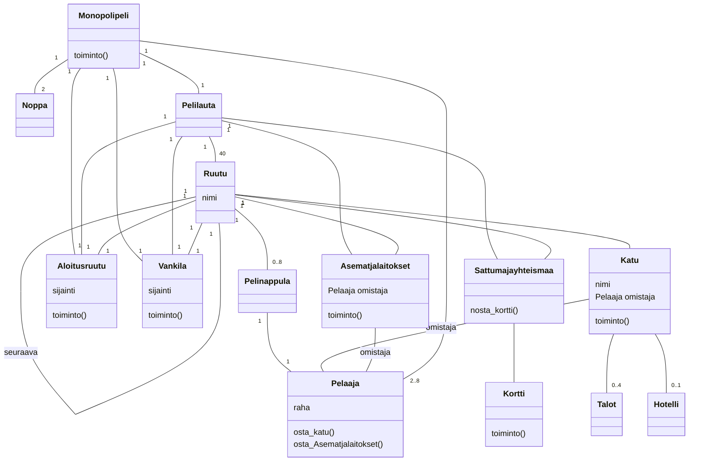

```mermaid
 classDiagram
    Monopolipeli "1" -- "2" Noppa
    Monopolipeli "1" -- "1" Pelilauta
    Pelilauta "1" -- "40" Ruutu
    Ruutu "1" -- "1" Ruutu : seuraava
    Ruutu "1" -- "0..8" Pelinappula
    Pelinappula "1" -- "1" Pelaaja
    Pelaaja "2..8" -- "1" Monopolipeli

    Monopolipeli "1" -- "1" Aloitusruutu
    Monopolipeli "1" -- "1" Vankila

    Pelilauta "1" -- "1" Aloitusruutu
    Pelilauta "1" -- "1" Vankila
    Pelilauta "1" -- "" Sattumajayhteismaa
    Pelilauta "1" -- "" Asematjalaitokset
    
    Ruutu "1" -- "1" Aloitusruutu
    Ruutu"1" -- "1" Vankila
    Ruutu "1" -- "" Sattumajayhteismaa
    Ruutu "1" -- "" Asematjalaitokset
    Ruutu "1" -- "" Katu

    Sattumajayhteismaa "" -- "" Kortti
    
  

    Katu "" -- "" Pelaaja: omistaja
    Asematjalaitokset "" -- "" Pelaaja: omistaja
    Katu "" -- "0..4" Talot
    Katu "" -- "0..1" Hotelli
    


  
    class Monopolipeli {
        toiminto()
        
    }
    class Ruutu {
        nimi
        
    }
    class Aloitusruutu {
        sijainti
        toiminto()
    }
  
    class Vankila {
         sijainti
         toiminto()
        
    }
  
    class Sattumajayhteismaa {
         nosta_kortti()

         
          
    }
    class Asematjalaitokset {
         Pelaaja omistaja    
         toiminto()

    }
    class Katu {
        nimi
        Pelaaja omistaja
        toiminto()
    }
    class Kortti {
        
        toiminto()
    }

        class Pelaaja {
        
        raha
        osta_katu()
        osta_Asematjalaitokset()
    }

```
