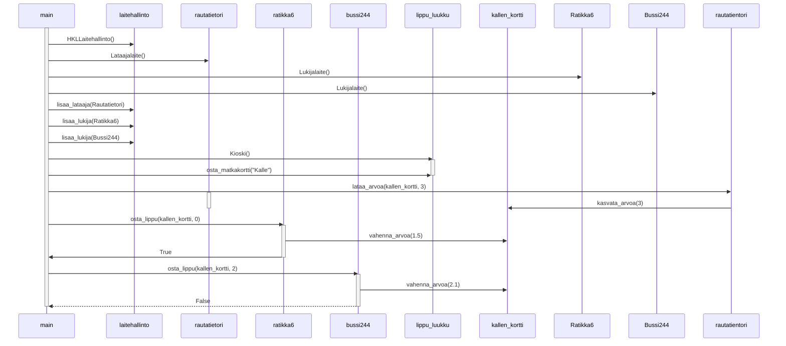

```mermaid
sequenceDiagram
participant main
participant laitehallinto
participant rautatietori
participant ratikka6
participant bussi244
participant lippu_luukku
participant kallen_kortti

activate main

main->>laitehallinto: HKLLaitehallinto()
main->>rautatietori: Lataajalaite()
main->>Ratikka6: Lukijalaite()
main->>Bussi244: Lukijalaite()

main->>laitehallinto: lisaa_lataaja(Rautatietori)
main->>laitehallinto: lisaa_lukija(Ratikka6)
main->>laitehallinto: lisaa_lukija(Bussi244)

main->>lippu_luukku: Kioski()

activate lippu_luukku
main ->> lippu_luukku: osta_matkakortti("Kalle")
deactivate lippu_luukku

main ->> rautatientori: lataa_arvoa(kallen_kortti, 3)

activate rautatietori
rautatientori ->> kallen_kortti: kasvata_arvoa(3)
deactivate rautatietori

main->>ratikka6: osta_lippu(kallen_kortti, 0)
activate ratikka6
ratikka6 ->> kallen_kortti: vahenna_arvoa(1.5)
ratikka6->>main: True
deactivate ratikka6

main ->> bussi244: osta_lippu(kallen_kortti, 2)
activate bussi244
bussi244->>kallen_kortti: vahenna_arvoa(2.1)
bussi244 -->> main: False
deactivate bussi244

deactivate main


```
